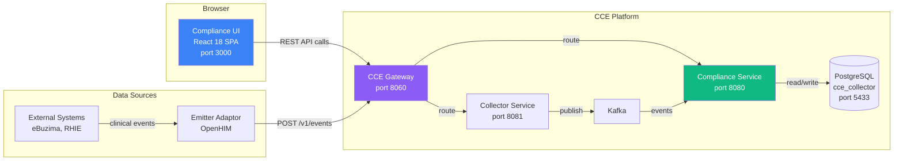
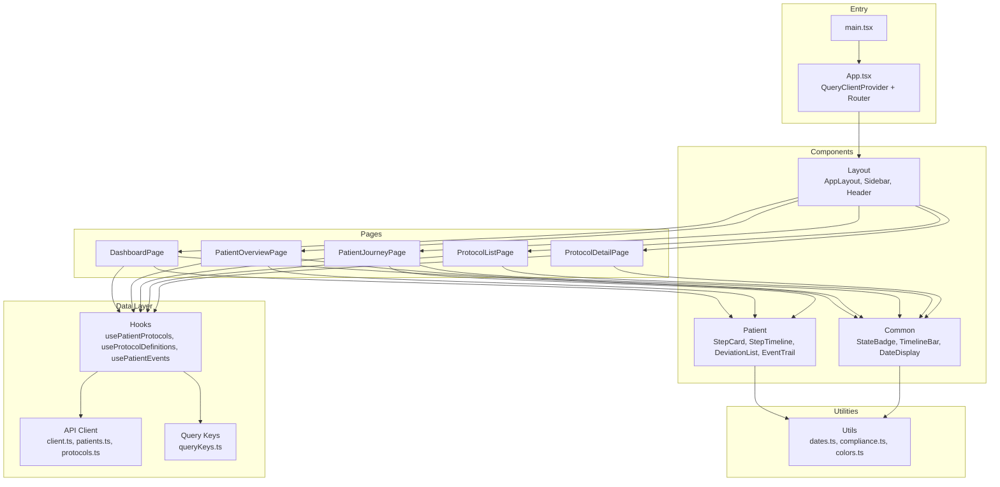
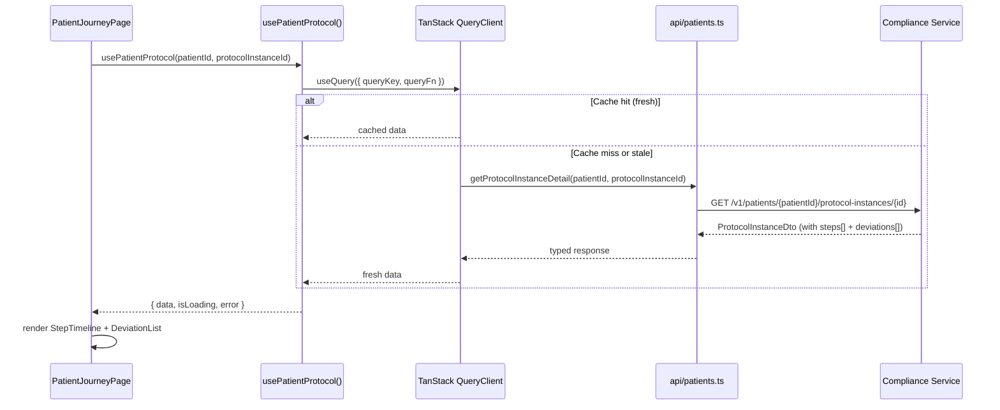

# Architecture Overview

> **CCE Compliance UI** — Demo-focused React application for patient journey visualization  
> **Version**: 1.0.0 | **Last Updated**: 2026-03-30

---

## Table of Contents

1. [System Context](#1-system-context)
2. [Technology Stack](#2-technology-stack)
3. [Application Architecture](#3-application-architecture)
4. [Page & Component Hierarchy](#4-page--component-hierarchy)
5. [Data Flow](#5-data-flow)
6. [State Management](#6-state-management)
7. [Routing](#7-routing)
8. [Styling System](#8-styling-system)
9. [Error Handling](#9-error-handling)
10. [Performance](#10-performance)
11. [Deployment](#11-deployment)

---

## 1. System Context

The Compliance UI is a **read-only** React SPA that visualizes patient compliance journeys by consuming existing Compliance Service REST APIs. It replaces Grafana dashboards with a purpose-built, customer-friendly interface for demos.



### API Flow

Both demo and production modes route API calls through the CCE Gateway:

```
Browser (port 3000) ──REST──▶ CCE Gateway (port 8060) ──▶ Compliance Service (port 8080) ──▶ PostgreSQL
```

In demo mode, OAuth is disabled at the gateway level (`VITE_AUTH_ENABLED=false`), but the request path is the same.

---

## 2. Technology Stack

| Layer | Technology | Version | Purpose |
|-------|-----------|---------|---------|
| **Framework** | React | 18.x | Component-based UI |
| **Language** | TypeScript | 5.x | Type safety |
| **Build** | Vite | 6.x | Fast dev server, optimized builds |
| **Routing** | React Router | 7.x | Client-side page navigation |
| **Server State** | TanStack Query | 5.x | API data fetching, caching, polling |
| **Styling** | Tailwind CSS | 4.x | Utility-first CSS |
| **Icons** | Heroicons | 2.x | Consistent icon set |
| **Charts** | Recharts | 2.x | Dashboard bar/pie/line charts |
| **Dates** | date-fns | 4.x | Date formatting, diff calculation |
| **Testing** | Vitest + Testing Library | latest | Component + hook tests |
| **API Mocking** | MSW | 2.x | Mock Service Worker for tests |
| **Linting** | ESLint + Prettier | latest | Code quality |

### Why These Choices

- **Vite over CRA/Next.js**: SPA with no SSR needs; fastest dev server; minimal config
- **TanStack Query over Redux**: No client mutations; all data is server-owned; built-in polling, caching, stale-while-revalidate
- **Tailwind over component libraries**: No MUI/Ant overhead; full design control; consistent with demo aesthetics; small bundle
- **Recharts over D3**: Simple chart API for dashboard; D3 is overkill for bar/pie charts

---

## 3. Application Architecture



### Layer Responsibilities

| Layer | Responsibility | Rule |
|-------|---------------|------|
| **Pages** | Route-level components; compose layout + data hooks + child components | One page per route; no direct `fetch` calls |
| **Components** | Visual rendering; receive data via props | Stateless where possible; no API calls |
| **Hooks** | TanStack Query wrappers; return `{ data, isLoading, error }` | One hook per API resource/query; use centralized `queryKeys` |
| **API** | Typed `fetch` wrappers; URL construction, error parsing; centralized query key factory (`queryKeys.ts`) | No React dependencies; pure TypeScript |
| **Utils** | Pure functions for formatting, computation, color mapping | No side effects |

---

## 4. Page & Component Hierarchy

```
App
├── AppLayout
│   ├── Sidebar (nav links, active indicators)
│   ├── Header (patient search bar, title)
│   └── <Outlet/> (page content)
│
├── / → DashboardPage
│   ├── MetricCard × 4 (protocols, patients, deviations, compliance %)
│   ├── ComplianceChart (Recharts bar chart — completion by protocol)
│   └── RecentDeviationsTable (latest deviations across protocols)
│
├── /patients/:patientId → PatientOverviewPage
│   ├── PatientHeader (ID, enrollment count)
│   └── ProtocolInstanceCard × N (protocol name, status, enrolled date, step summary)
│
├── /patients/:patientId/protocols/:protocolInstanceId → PatientJourneyPage
│   ├── JourneyHeader (protocol info, status, compliance rate, enrollment date)
│   ├── StepTimeline (vertical)
│   │   └── StepCard × N (action name, state badge, dates, completion info, deviation indicator)
│   ├── DeviationList (sidebar panel)
│   │   └── DeviationBadge × N (type, step, days late)
│   └── EventTrail (paginated table)
│       └── EventRow × N (time, source, type, matched action, status)
│
├── /protocols → ProtocolListPage
│   └── ProtocolCard × N (name, version, status, action count, loaded date)
│
└── /protocols/:id → ProtocolDetailPage
    ├── ProtocolHeader (canonical URL, version, status)
    ├── ActionList (all defined actions from PlanDefinition)
    │   └── ActionCard × N (action ID, trigger type, timing, dependencies, required behavior)
    └── PlanDefinitionViewer (collapsible raw JSON)
```

---

## 5. Data Flow

### 5.1 API Request Lifecycle



### 5.2 Polling for Live Updates

```typescript
// Active patient journey view uses refetchInterval with retry/backoff
import { queryKeys } from '../api/queryKeys';

useQuery({
  queryKey: queryKeys.patients.protocolDetail(patientId, protocolInstanceId),
  queryFn: () => getProtocolInstanceDetail(patientId, protocolInstanceId),
  refetchInterval: POLLING_INTERVAL, // default 30s, 0 to disable
  retry: 3,
  retryDelay: (attempt) => Math.min(1000 * 2 ** attempt, 30_000), // exponential backoff
});
```

This enables live updates during demos — submit an event via Postman, and the UI reflects the step completion within 30 seconds without page refresh. Polling failures are retried with exponential backoff (1s → 4s → 8s, capped at 30s) to handle transient network issues gracefully.

---

## 6. State Management

| State Type | Tool | Examples |
|-----------|------|---------|
| **Server state** (API data) | TanStack Query | Protocol instances, steps, events, definitions |
| **URL state** | React Router | Patient ID, protocol instance ID, pagination |
| **UI state** | React `useState` | Sidebar open/closed, selected tab, expanded JSON |
| **No global client state store** | — | No Redux, Zustand, or Context for data |

### Query Key Strategy

All query keys are centralized in `src/api/queryKeys.ts` to avoid scattered string literals and ensure consistency:

```typescript
// src/api/queryKeys.ts
export const queryKeys = {
  protocols: {
    all: ['protocols'] as const,
    detail: (id: string) => ['protocols', id] as const,
  },
  patients: {
    protocols: (patientId: string) =>
      ['patients', patientId, 'protocols'] as const,
    protocolDetail: (patientId: string, instanceId: string) =>
      ['patients', patientId, 'protocols', instanceId] as const,
    events: (patientId: string, page: number, size: number) =>
      ['patients', patientId, 'events', { page, size }] as const,
  },
} as const;
```

All hooks import and use `queryKeys` instead of inline string arrays. This enables type-safe key construction, IDE autocompletion, and single-source-of-truth for cache invalidation.

---

## 7. Routing

```typescript
const router = createBrowserRouter([
  {
    path: '/',
    element: <AppLayout />,
    children: [
      { index: true, element: <DashboardPage /> },
      { path: 'patients/:patientId', element: <PatientOverviewPage /> },
      { path: 'patients/:patientId/protocols/:protocolInstanceId', element: <PatientJourneyPage /> },
      { path: 'protocols', element: <ProtocolListPage /> },
      { path: 'protocols/:protocolId', element: <ProtocolDetailPage /> },
    ],
  },
]);
```

### Navigation Flow

```
Dashboard → (enter patient ID in search) → Patient Overview → (click protocol) → Patient Journey
Dashboard → Protocols → Protocol Detail
```

---

## 8. Styling System

### Step State Color Palette

| State | Background | Text | Dot/Border | Tailwind Classes |
|-------|-----------|------|-----------|-----------------|
| `PENDING` | gray-100 | gray-700 | gray-400 | `bg-gray-100 text-gray-700` |
| `DUE` | blue-100 | blue-700 | blue-500 | `bg-blue-100 text-blue-700` |
| `OVERDUE` | amber-100 | amber-700 | amber-500 | `bg-amber-100 text-amber-700` |
| `MISSED` | red-100 | red-700 | red-500 | `bg-red-100 text-red-700` |
| `COMPLETED` | green-100 | green-700 | green-500 | `bg-green-100 text-green-700` |
| `SKIPPED` | slate-100 | slate-500 | slate-400 | `bg-slate-100 text-slate-500` |

### Protocol Status Colors

| Status | Color |
|--------|-------|
| `ACTIVE` | green |
| `COMPLETED` | blue |
| `WITHDRAWN` | amber |
| `EXPIRED` | red |

### Layout Constants

- Sidebar width: 256px (collapsible to 64px icon-only)
- Max content width: 1280px (centered)
- Card border radius: 8px (`rounded-lg`)
- Card shadow: `shadow-sm` (subtle)

---

## 9. Error Handling

### API Errors

```typescript
// Compliance Service error envelope
interface ApiError {
  status: number;
  error: string;
  message: string;
  path: string;
  timestamp: string;
  fieldErrors: { field: string; message: string }[] | null;
}
```

| Error | UI Behavior |
|-------|------------|
| `404` (patient/protocol not found) | Show "Patient not found" empty state with search prompt |
| `500` (server error) | Show error banner with retry button |
| Network error | Show "Cannot connect to server" with connection instructions |
| Loading timeout (>10s) | Show skeleton then fallback message |

### Error Boundaries

Each page wrapped in an error boundary that catches render errors and shows a recovery UI.

---

## 10. Performance

| Technique | Implementation |
|-----------|---------------|
| **Query caching** | TanStack Query default `staleTime: 5000ms`, `gcTime: 300000ms` |
| **Memoization** | `useMemo` for derived data: filtered lists, compliance rate, step groupings, detail lookups |
| **Safe date parsing** | `safeParse()` wrapper returns fallback on malformed ISO strings instead of crashing |
| **Retry with backoff** | Polling hooks use `retry: 3` with exponential backoff (1s → 4s → 8s, cap 30s) |
| **Code splitting** | React.lazy per page — loads only active route |
| **Bundle optimization** | Vite tree-shaking; Recharts imported per-chart |
| **Image-free** | No images; icons via Heroicons SVG components |
| **Skeleton loading** | Tailwind `animate-pulse` placeholders during fetch |

---

## 11. Deployment

### Development

```bash
npm run dev    # Vite dev server on port 3000 with HMR
```

### Production (Docker + Host Caddy)

The UI runs as a Docker container serving static files. The EC2 host's Caddy (already deployed) reverse-proxies browser traffic to the container and `/v1/*` API calls to the CCE Gateway.

```dockerfile
# Stage 1: Build
FROM node:22-alpine AS build
WORKDIR /app
COPY package*.json ./
RUN npm ci
COPY . .
RUN npm run build

# Stage 2: Serve static SPA
FROM caddy:2-alpine
COPY --from=build /app/dist /srv
COPY Caddyfile /etc/caddy/Caddyfile
EXPOSE 3000
```

### Container Caddyfile

The container's Caddy only serves the SPA with `try_files` fallback and caches static assets. No API proxying — that is handled by the host Caddy.

```caddyfile
:3000
root * /srv
try_files {path} /index.html
file_server

@static path *.js *.css *.svg *.png *.ico *.woff2
header @static Cache-Control "public, max-age=31536000, immutable"
```

### Host Caddy Configuration

The host Caddy routes `/v1/*` to the CCE Gateway and everything else to the UI container.

See `deploy/caddy-site.example` for a ready-to-use snippet.
